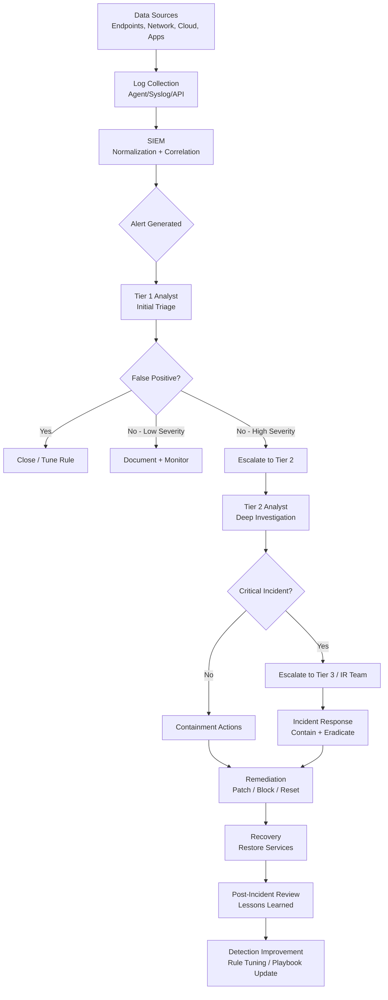
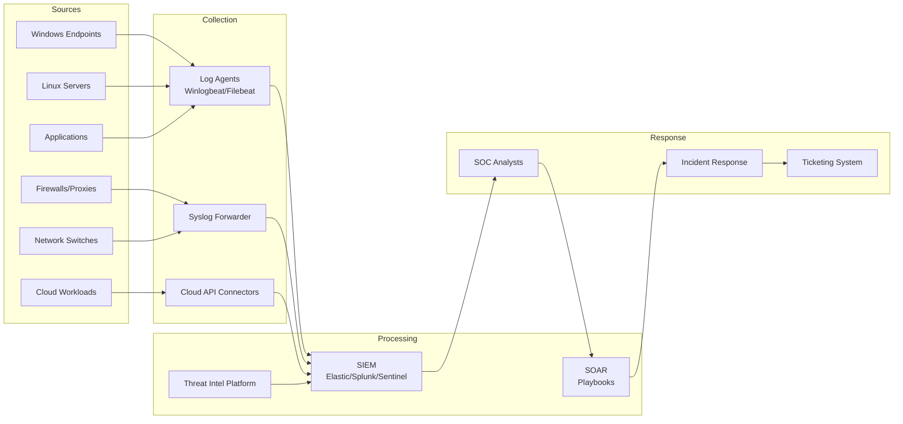
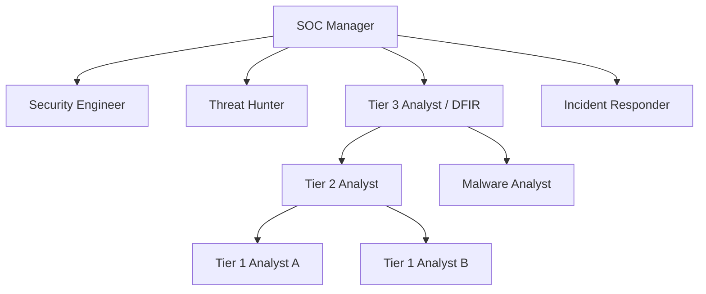
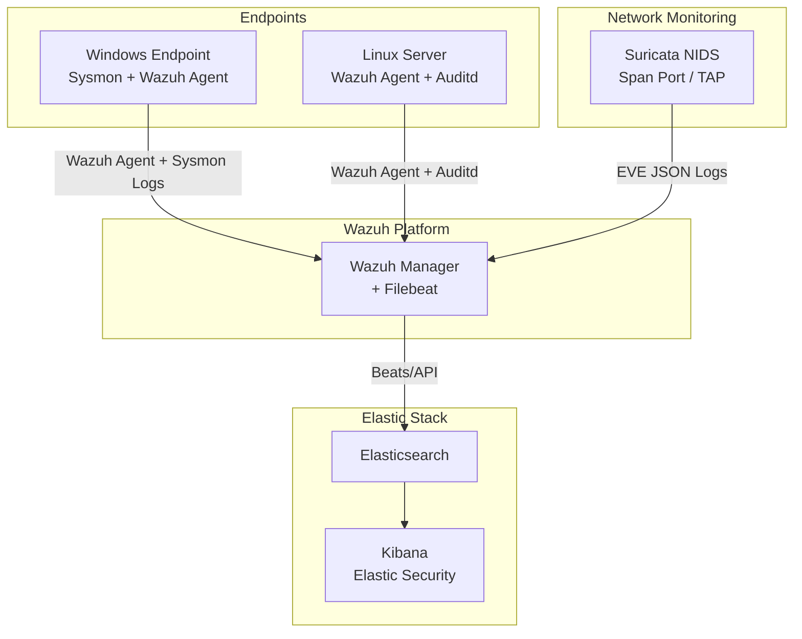

# Security Operations Center (SOC) — Complete Overview

> **A comprehensive, technical, and portfolio-quality handbook for SOC analysts, blue team practitioners, and cybersecurity learners.**

## 1. Introduction to SOC

### What is a SOC?

A **Security Operations Center (SOC)** is a centralized facility — physical or virtual — where a team of cybersecurity professionals monitors, detects, analyzes, and responds to security threats and incidents across an organization's entire IT infrastructure on a 24×7 basis.

The SOC acts as the **nerve center** of an organization's security posture, continuously ingesting data from endpoints, networks, cloud environments, applications, and identity systems to identify anomalous behavior and potential breaches before they cause significant damage.

A SOC is not just a room with screens — it is a combination of **people, processes, and technology** working in concert:

- **People**: Skilled analysts, incident responders, threat hunters, and security engineers
- **Processes**: Defined workflows, playbooks, escalation paths, and SLAs
- **Technology**: SIEM, SOAR, EDR, XDR, threat intelligence platforms, and more

### Purpose of SOC

| Purpose | Description |
|---|---|
| Continuous Monitoring | 24×7 visibility across endpoints, networks, and cloud |
| Threat Detection | Identify malicious activity using correlation rules, behavioral analytics, and threat intelligence |
| Incident Response | Contain, eradicate, and recover from security incidents |
| Vulnerability Management | Track and remediate known weaknesses |
| Compliance | Maintain audit trails and meet regulatory requirements |
| Threat Intelligence | Operationalize threat feeds to proactively defend |
| Forensic Analysis | Investigate incidents to determine root cause |

### Why Organizations Need a SOC

Modern organizations face an unprecedented volume and sophistication of cyber threats. The reasons a SOC is essential include:

- **Attack Surface Expansion**: Cloud, IoT, remote work, and SaaS have dramatically increased the number of systems that need monitoring.
- **Dwell Time Reduction**: Without a SOC, the average attacker dwell time inside a network is over 200 days. A mature SOC compresses this to hours or days.
- **Regulatory Compliance**: PCI-DSS, HIPAA, GDPR, ISO 27001, and SOC 2 mandate continuous security monitoring.
- **Incident Velocity**: Modern attacks move fast — ransomware can encrypt a full domain within minutes. Only a 24×7 SOC can respond in time.
- **Centralized Visibility**: Without centralized log aggregation and correlation, threats that span multiple systems go undetected.

### Evolution of SOC

```
Generation 1 (1990s)     →  Firewall/IDS monitoring. Reactive.
Generation 2 (2000s)     →  SIEM introduced. Log aggregation and correlation.
Generation 3 (2010s)     →  Threat intelligence integration. SOAR for automation.
Generation 4 (2015–2020) →  EDR/XDR. Behavioral analytics. Cloud monitoring.
Generation 5 (2020+)     →  AI/ML-driven SOC. Autonomous detection. Zero Trust integration.
```

| Era | Key Technology | Focus |
|---|---|---|
| 1990s | Firewalls, IDS | Perimeter defense |
| 2000s | SIEM (ArcSight, Splunk) | Log management |
| 2010s | SOAR, Threat Intel | Automation, enrichment |
| 2020s | XDR, AI/ML, Cloud SIEM | Integrated detection and response |


---

## 2. Importance of SOC in Real World

### Cyber Threats Faced by Organizations

Modern enterprises face a diverse and evolving threat landscape:

| Threat Category | Examples | Impact |
|---|---|---|
| Ransomware | LockBit, BlackCat, Cl0p | Encryption of data, extortion |
| Phishing / Spear Phishing | BEC, credential harvesting | Account compromise, financial loss |
| Advanced Persistent Threats (APT) | APT28, Lazarus Group | Long-term espionage, data exfiltration |
| Insider Threats | Disgruntled employees, contractor misuse | Data leakage, sabotage |
| Supply Chain Attacks | SolarWinds, MOVEit | Broad organizational compromise |
| DDoS | Botnet-driven floods | Service outages |
| Zero-Day Exploits | Unpatched vulnerabilities | Initial access, privilege escalation |
| Credential Stuffing | Leaked password databases | Unauthorized account access |

### Why Continuous Monitoring Matters

Attacks do not follow business hours. The majority of significant breaches occur outside of standard working hours — over weekends, during holidays, and at night — precisely because attackers know that response capability is reduced.

Without continuous monitoring:
- A **compromised endpoint** can communicate with a C2 server for weeks unnoticed
- **Lateral movement** can propagate through the network silently
- **Data exfiltration** may occur slowly over months to avoid detection thresholds
- **Privilege escalation** may go unnoticed until an attacker achieves domain admin

Continuous monitoring provides the ability to detect threats in near real-time and act before the damage becomes irreversible.

### Business Impact of Cyber Attacks

| Impact Category | Description | Example |
|---|---|---|
| Financial Loss | Direct costs of breach response, ransomware payments | Average breach cost: $4.45M (IBM 2023) |
| Reputational Damage | Customer trust erosion | Target breach (2013) — stock fell 46% |
| Operational Disruption | Business continuity failure | Colonial Pipeline shutdown (2021) |
| Legal and Regulatory Fines | Non-compliance penalties | GDPR fines up to 4% of global turnover |
| Intellectual Property Theft | Loss of trade secrets | Nation-state espionage operations |


### SOC Across Industries

**Enterprise SOC**: Protects corporate IT assets — Active Directory, email, ERP systems, endpoints.

**Banking and Financial SOC**: Focuses on fraud detection, transaction monitoring, ATM network security, and regulatory compliance (PCI-DSS, SOX).

**Healthcare SOC**: Prioritizes protection of PHI (Protected Health Information), medical device security, and HIPAA compliance.

**Government SOC**: Defends critical infrastructure, classified systems, and citizen data. Often integrates with national CERT.

**Cloud-Native SOC**: Monitors cloud workloads (AWS, Azure, GCP), IAM policies, serverless functions, and container environments.

---

## 3. SOC Architecture and Workflow

### SOC Workflow: From Alert to Incident Closure



### How Data Flows Inside a SOC



### Alert Triage Process

When an alert fires in the SIEM, Tier 1 analysts follow a structured triage methodology:

1. **Alert Review**: Read the alert details — rule name, severity, affected asset, time, raw log.
2. **Context Enrichment**: Query threat intel for IP/hash/domain reputation. Pull surrounding logs.
3. **Baseline Comparison**: Is this activity normal for this user/system? Compare to historical behavior.
4. **Classification**: Determine true positive, false positive, or benign true positive.
5. **Escalation Decision**: Based on severity and classification, escalate or close.
6. **Documentation**: Log findings in the ticketing system regardless of outcome.

### Incident Lifecycle

| Phase | Activity | Owner |
|---|---|---|
| Detection | Alert generated in SIEM | Automated / Tier 1 |
| Triage | Validate alert, enrich context | Tier 1 |
| Analysis | Deep-dive investigation, scope determination | Tier 2 |
| Containment | Isolate affected systems, block IOCs | Tier 2 / IR |
| Eradication | Remove malware, revoke credentials | IR / Tier 3 |
| Recovery | Restore systems, verify clean state | IT + IR |
| Post-Incident | Root cause analysis, playbook improvement | SOC Manager + Team |

### Escalation Process

```
Alert Fired
    │
    ▼
Tier 1 (0–30 min SLA)
    │ Not resolved → Escalate
    ▼
Tier 2 (1–2 hr SLA)
    │ Critical / Complex → Escalate
    ▼
Tier 3 / IR Team (Immediate for P1)
    │ Major breach → Escalate
    ▼
CISO / Executive Team + Legal (For major incidents)
```

---

## 4. SOC Team Structure

### Overview



---

### Tier 1 Analyst (Alert Triage Analyst)

**Responsibilities:**
- Monitor SIEM dashboards and alert queues in real-time
- Perform initial triage on all incoming alerts
- Classify alerts as true positive, false positive, or benign
- Escalate confirmed incidents to Tier 2
- Document all actions in ticketing system
- Handle high alert volumes efficiently

**Skills Required:**
- Understanding of common attack techniques (MITRE ATT&CK)
- Basic log analysis (Windows Event Logs, Syslog, firewall logs)
- Familiarity with SIEM queries (SPL, KQL, Lucene)
- Understanding of network protocols (TCP/IP, DNS, HTTP)
- Strong written communication for documentation

**Tools Used:**
- SIEM (Splunk, Elastic, Sentinel, QRadar)
- Ticketing system (ServiceNow, Jira)
- Threat Intel lookup (VirusTotal, AbuseIPDB, Shodan)
- EDR console (CrowdStrike Falcon, Microsoft Defender)

**Real-World Tasks:**
- Reviewing 50–200 alerts per shift
- Identifying whether a login from an unusual country is a true attack or a VPN connection
- Looking up a suspicious IP in VirusTotal and correlating with firewall deny logs

---

### Tier 2 Analyst (Incident Analyst)

**Responsibilities:**
- Perform deep-dive investigation on escalated incidents
- Determine full scope and impact of an incident
- Conduct log correlation across multiple data sources
- Perform containment actions (isolate host, block IP, disable account)
- Develop and run SIEM queries for investigation
- Write detailed incident reports

**Skills Required:**
- Advanced log analysis and log correlation
- Proficiency in at least one SIEM query language
- Understanding of malware behavior and attack chains
- Network traffic analysis (Wireshark, Zeek)
- Endpoint forensics basics (file system, registry, process analysis)
- Knowledge of lateral movement, persistence, and privilege escalation techniques

**Tools Used:**
- SIEM + SOAR
- EDR with deep investigation capabilities
- Wireshark, Zeek, NetworkMiner
- Memory analysis tools (basic Volatility usage)
- Sandbox (Any.run, Joe Sandbox)

**Real-World Tasks:**
- Tracing a phishing email from initial delivery to credential theft to lateral movement
- Determining whether a PowerShell execution event is legitimate admin activity or a post-exploit payload
- Correlating authentication logs, process logs, and network logs to reconstruct an attack timeline

---

### Tier 3 Analyst (Senior Analyst / Hunt Lead)

**Responsibilities:**
- Handle the most complex and high-severity incidents
- Lead threat hunting campaigns
- Develop custom detection rules and SIEM content
- Perform advanced malware analysis and reverse engineering
- Mentor Tier 1 and Tier 2 analysts
- Liaise with executive leadership during major incidents

**Skills Required:**
- Advanced forensics and malware analysis
- Proficiency in scripting (Python, PowerShell, Bash)
- Deep knowledge of attacker TTPs and APT behavior
- Reverse engineering basics (static and dynamic analysis)
- Advanced threat hunting skills
- Security research capability

**Tools Used:**
- Full forensics toolkit (Volatility, Autopsy, FTK)
- Custom scripts, Jupyter notebooks
- Ghidra, IDA Pro (for reverse engineering)
- Threat intelligence platforms (MISP, OpenCTI)

---

### Incident Responder

**Responsibilities:**
- Lead containment and eradication during active incidents
- Coordinate with IT, legal, HR, and executive teams
- Conduct live forensic acquisition on compromised systems
- Provide guidance on recovery steps
- Maintain chain of custody for forensic evidence

**Skills Required:**
- Incident response methodologies (PICERL, NIST 800-61)
- Live forensics and memory acquisition
- Crisis communication
- Malware removal and system hardening
- Legal and regulatory awareness

**Tools Used:**
- DFIR tools (Kape, Velociraptor, FTK Imager)
- EDR for remote isolation
- Memory acquisition tools (WinPmem, Magnet RAM Capture)

---

### Threat Hunter

**Responsibilities:**
- Proactively search for hidden threats not caught by automated detections
- Develop hypotheses based on threat intelligence and TTPs
- Analyze large datasets to find anomalies
- Develop new detection rules based on hunt findings
- Document and publish hunt reports

**Skills Required:**
- Advanced analytical thinking and hypothesis formation
- Data analysis (pandas, SQL, SPL)
- Deep understanding of MITRE ATT&CK
- Knowledge of attacker tradecraft (living-off-the-land, fileless malware)
- Scripting for data manipulation

**Tools Used:**
- SIEM/EDR with query capability
- Jupyter notebooks, pandas
- OSQuery, Velociraptor
- MISP, OpenCTI

---

### SOC Manager

**Responsibilities:**
- Oversee all SOC operations and personnel
- Define SLAs, KPIs, and performance metrics
- Manage staffing, training, and shift scheduling
- Report to CISO on security posture
- Drive continuous improvement of SOC processes

**Skills Required:**
- Deep technical background in cybersecurity
- Leadership, communication, and people management
- Budget management
- Understanding of regulatory requirements
- Strategic planning

---


## 5. Core SOC Technologies

### SIEM (Security Information and Event Management)

**Purpose:** Centralize log collection, normalize data, correlate events, and generate alerts.

**How it works:**
1. Agents or forwarders collect logs from endpoints, network devices, and cloud
2. Logs are normalized into a common schema
3. Correlation rules evaluate log patterns and generate alerts
4. Analysts query the SIEM to investigate
5. Dashboards provide visibility into the security posture

**Advantages:**
- Single pane of glass for all security events
- Cross-source correlation catches what individual tools miss
- Historical log retention for forensic investigation
- Compliance reporting built-in

**Limitations:**
- High false positive rate without proper tuning
- Resource-intensive at scale
- Requires skilled personnel to write effective rules
- Log ingestion costs can be significant

**Real-world Use Case:** An analyst notices failed authentication events from 10 different IP addresses targeting the same user account over 5 minutes. The SIEM correlation rule detects this as a brute-force pattern and fires a high-severity alert.

---

### SOAR (Security Orchestration, Automation and Response)

**Purpose:** Automate repetitive SOC tasks and orchestrate multi-tool response workflows.

**How it works:** Playbooks define step-by-step automated workflows triggered by SIEM alerts. Actions include enrichment, notification, containment, and ticketing — all without analyst intervention.

**Example Playbook:**
```
Trigger: SIEM alert "Suspicious login from TOR exit node"
Steps:
  1. Query threat intel for IP reputation
  2. Check if user account is a privileged account
  3. If privileged: auto-disable account + notify SOC manager
  4. If standard: send Slack alert to analyst + create JIRA ticket
  5. Block IP on firewall via API call
  6. Log all actions in case management system
```

**Advantages:**
- Dramatically reduces Mean Time to Respond (MTTR)
- Reduces analyst burnout by automating repetitive tasks
- Consistent response quality — no human error
- Scales incident response without additional headcount

**Limitations:**
- Complex to build and maintain playbooks
- Risk of automation errors causing unintended disruptions
- Requires robust API integrations across tools

---

### EDR (Endpoint Detection and Response)

**Purpose:** Monitor endpoint activity in real-time, detect malicious behavior, and enable remote investigation and response.

**How it works:** A lightweight agent on each endpoint collects telemetry — process creation, file operations, network connections, registry modifications, and memory activity — and sends it to a central platform for analysis using behavioral rules and ML models.

**Key Capabilities:**
- Real-time process tree visualization
- File hash blocking and quarantine
- Remote shell access for live investigation
- Threat hunting with historical telemetry
- Automated response (isolate host, kill process)

**Examples:** CrowdStrike Falcon, Microsoft Defender for Endpoint, SentinelOne, Carbon Black

**Real-world Use Case:** An analyst receives an EDR alert showing `cmd.exe` spawned by `winword.exe` — a classic macro-enabled document execution chain. The analyst reviews the process tree, sees a suspicious PowerShell download cradle, and isolates the endpoint before lateral movement occurs.

---

### XDR (Extended Detection and Response)

**Purpose:** Extend EDR capabilities beyond the endpoint to include network, cloud, email, and identity telemetry in a unified detection and response platform.

**How it works:** XDR ingests telemetry from multiple security layers (endpoint, network, email, identity, cloud) and correlates cross-domain events to detect sophisticated multi-stage attacks.

**EDR vs XDR:**

| Feature | EDR | XDR |
|---|---|---|
| Scope | Endpoint only | Multi-domain |
| Correlation | Single source | Cross-source |
| Integration | Limited | Native |
| Complexity | Lower | Higher |

**Examples:** Palo Alto Cortex XDR, Microsoft Defender XDR, CrowdStrike Falcon XDR

---

### IDS (Intrusion Detection System)

**Purpose:** Monitor network traffic or host activity for known attack signatures or anomalous behavior and generate alerts.

**Types:**
- **Network IDS (NIDS)**: Monitors network traffic (e.g., Suricata, Snort)
- **Host IDS (HIDS)**: Monitors system activity on individual hosts (e.g., OSSEC, Wazuh)

**Detection Methods:**
- **Signature-based**: Matches traffic against known attack patterns (fast, low false positives for known threats)
- **Anomaly-based**: Detects deviations from baseline behavior (catches unknowns, higher false positives)
- **Stateful protocol analysis**: Tracks protocol states to detect protocol violations

**Limitations:** IDS only alerts — it does not block.

---

### IPS (Intrusion Prevention System)

**Purpose:** Like IDS, but actively blocks detected threats inline.

**How it works:** Deployed inline in the network path. Analyzes traffic in real-time and drops or resets malicious connections based on rules.

**Advantages over IDS:** Active prevention, not just detection.
**Limitations:** Risk of blocking legitimate traffic (false positives cause outages). Requires careful tuning.

---

### Firewall

**Purpose:** Control network traffic based on rules (permit/deny) for specific IPs, ports, and protocols.

**Types:**

| Type | Description |
|---|---|
| Packet Filtering | Basic ACL-based filtering on IP/port |
| Stateful Inspection | Tracks TCP connection state |
| Application Layer (NGFW) | Deep packet inspection, application identification, SSL inspection |

**Log Value in SOC:** Firewall logs are critical for identifying C2 communication, lateral movement, data exfiltration, and policy violations.

---

### Threat Intelligence Platforms (TIP)

**Purpose:** Aggregate, normalize, correlate, and operationalize threat intelligence from multiple sources.

**Functions:**
- Ingest threat feeds (OSINT, commercial, government)
- Enrich IOCs with context (malware family, actor, campaign)
- Share indicators via STIX/TAXII
- Feed indicators directly to SIEM and firewalls for automated blocking

**Examples:** MISP, OpenCTI, ThreatConnect, Anomali ThreatStream

---

### Sysmon (System Monitor)

**Purpose:** Windows system service that logs detailed telemetry including process creation, network connections, file creation, registry modifications, and driver loads.

**Key Event IDs:**

| Event ID | Description |
|---|---|
| 1 | Process creation (with full command line and hashes) |
| 3 | Network connection |
| 7 | Image loaded (DLL) |
| 8 | CreateRemoteThread |
| 10 | ProcessAccess (e.g., LSASS dumping) |
| 11 | File creation |
| 13 | Registry value set |
| 22 | DNS query |

**Configuration:** Uses XML config file. SwiftOnSecurity and Olaf Hartong maintain popular community configs.

---

### Wazuh

**Purpose:** Open-source SIEM and XDR platform combining HIDS, log analysis, vulnerability detection, compliance, and threat detection.

**Components:**
- **Wazuh Agent**: Deployed on endpoints for log collection and active response
- **Wazuh Server**: Processes alerts and runs detection rules
- **OpenSearch/Kibana**: Visualization and querying

**Capabilities:**
- File Integrity Monitoring (FIM)
- Registry monitoring on Windows
- CIS benchmark compliance checks
- Active response (auto-block IP, kill process)
- Integration with MITRE ATT&CK framework

---

### Suricata

**Purpose:** High-performance open-source Network IDS/IPS and network security monitoring engine.

**Key Features:**
- Multi-threaded (scales on modern hardware)
- Supports signature-based detection (ET rules, custom rules)
- Protocol parsers for HTTP, DNS, TLS, SMB, and more
- Generates rich network metadata logs (EVE JSON format)
- File extraction capability

**Example Suricata Rule:**
```
alert http $HOME_NET any -> $EXTERNAL_NET any (
    msg:"ET TROJAN Possible Cobalt Strike Beacon Activity";
    flow:established,to_server;
    content:"POST"; http_method;
    content:"/submit.php"; http_uri;
    classtype:trojan-activity;
    sid:2019034; rev:3;
)
```

---

### Elastic Stack (ELK)

**Purpose:** Log aggregation, search, and visualization platform widely used in SOC environments.

**Components:**
- **Elasticsearch**: Distributed search and analytics engine
- **Logstash / Beats**: Log shippers and processing pipelines
- **Kibana**: Visualization and querying UI
- **Elastic Security**: SIEM and EDR module built on the stack

**Key Query Language:** KQL (Kibana Query Language) and EQL (Event Query Language)

```kql
# KQL: Find failed logins
event.action:"logon-failed" and winlog.event_data.SubStatus:"0xC000006A"

# EQL: Detect LSASS dumping
process where process.name == "lsass.exe" and
  process.parent.name != "wininit.exe"
```

---

### Splunk

**Purpose:** Enterprise SIEM and data analytics platform. Industry standard in large SOCs.

**Query Language:** SPL (Search Processing Language)

```spl
# Detect brute force
index=windows EventCode=4625
| stats count by src_ip, user
| where count > 10
| sort -count

# Detect PowerShell encoded command
index=windows EventCode=4688
| where like(CommandLine, "%-enc%")
| table _time, ComputerName, User, CommandLine
```

**Splunk Apps of Note:**
- Splunk Enterprise Security (ES) — full SIEM
- Splunk SOAR — automated response
- Splunk Attack Analyzer — malware and phishing analysis

---

### Microsoft Sentinel

**Purpose:** Cloud-native SIEM and SOAR built on Azure, integrating natively with Microsoft 365, Azure AD, Defender, and third-party connectors.

**Query Language:** KQL (Kusto Query Language)

```kql
// Detect multiple failed logins
SigninLogs
| where ResultType != 0
| summarize FailedAttempts = count() by UserPrincipalName, IPAddress
| where FailedAttempts > 10
| sort by FailedAttempts desc
```

**Advantages:** Native cloud integration, pay-per-GB pricing, managed infrastructure.

---

### CrowdStrike Falcon

**Purpose:** Cloud-native EDR/XDR platform with industry-leading detection capability and minimal performance impact.

**Key Features:**
- Lightweight agent (~15MB RAM footprint)
- AI-powered prevention engine
- Real-time threat graph (process lineage visualization)
- Threat intelligence integration (CrowdStrike Intelligence)
- Managed detection service (Falcon Complete)

**Falcon Query Language (FQL):**
```
event_simpleName=ProcessRollup2
| CommandLine=/powershell/i
| CommandLine=/(-enc|-EncodedCommand)/i
| groupby([UserName, CommandLine])
```

---

### Zeek (formerly Bro)

**Purpose:** Network analysis framework that generates rich, structured network metadata logs rather than just alerting on signatures.

**Logs Produced:**
- `conn.log` — all TCP/UDP/ICMP connections
- `dns.log` — DNS queries and responses
- `http.log` — HTTP request/response metadata
- `ssl.log` — TLS handshake information
- `files.log` — files transferred over the network
- `weird.log` — protocol anomalies

**Real-world Use Case:** Zeek can detect long DNS tunneling sessions by analyzing query frequency, query length, and response data volume — patterns invisible to signature-only IDS.

---

### OSQuery

**Purpose:** Exposes the operating system as a relational database. Analysts can write SQL queries to inspect running processes, network connections, user accounts, and more in real-time.

```sql
-- Find processes making outbound connections
SELECT p.name, p.pid, p.path, l.local_port, l.remote_address, l.remote_port
FROM processes AS p
JOIN listening_ports AS l ON p.pid = l.pid
WHERE l.remote_address NOT IN ('0.0.0.0', '::');

-- Find recently modified files in system directories
SELECT path, mtime, size
FROM file
WHERE path LIKE '/usr/bin/%'
AND mtime > (strftime('%s','now') - 86400);
```

---

## 6. SOC Monitoring and Log Analysis

### What are Logs?

Logs are structured or semi-structured records of events generated by operating systems, applications, network devices, and security tools. They provide the evidentiary foundation for all SOC investigations.

Logs answer the fundamental forensic questions: **Who did what, when, from where, and to what?**

### Types of Logs

| Log Type | Source | Key Fields |
|---|---|---|
| Windows Event Logs | Windows OS | EventID, Account Name, Logon Type, Source IP |
| Linux Syslog | Linux OS | Timestamp, Hostname, Process, Message |
| Authentication Logs | AD, LDAP, RADIUS | User, Source, Success/Failure, MFA status |
| Firewall Logs | Palo Alto, Cisco, pfSense | Src/Dst IP, Port, Protocol, Action |
| DNS Logs | DNS servers, Zeek | Query, Response, Client IP, Record type |
| Proxy Logs | Squid, Zscaler, Bluecoat | URL, Method, User-Agent, Response code |
| Network Flow Logs | NetFlow, IPFIX, Zeek | Src/Dst IP, Bytes, Packets, Duration |
| Application Logs | Web apps, databases | Requests, Errors, Auth events |
| Cloud Logs | AWS CloudTrail, Azure Activity | API calls, Resource access, IAM events |
| Sysmon Logs | Windows with Sysmon | Process, network, registry, file events |

### Windows Event Log — Key Event IDs

| Event ID | Description | Security Relevance |
|---|---|---|
| 4624 | Successful logon | Baseline authentication |
| 4625 | Failed logon | Brute force detection |
| 4648 | Explicit credential use | Pass-the-hash, runas |
| 4672 | Special privileges assigned | Privilege escalation |
| 4688 | Process creation | Malware execution |
| 4698 | Scheduled task created | Persistence |
| 4720 | User account created | Backdoor accounts |
| 4732 | User added to local group | Privilege escalation |
| 4768 | Kerberos TGT requested | Kerberoasting baseline |
| 4769 | Kerberos service ticket requested | Kerberoasting detection |
| 4776 | NTLM authentication | Pass-the-hash |
| 7045 | New service installed | Malware persistence |

### Linux Logs — Key Files

| Log File | Contents |
|---|---|
| `/var/log/auth.log` | SSH logins, sudo usage, PAM events |
| `/var/log/syslog` | General system events |
| `/var/log/kern.log` | Kernel messages |
| `/var/log/audit/audit.log` | Auditd events (detailed syscall logging) |
| `/var/log/apache2/access.log` | Web server access |
| `/var/log/secure` (RHEL) | Auth events |
| `/var/log/faillog` | Failed login attempts |

### Sysmon Logs

Sysmon dramatically enriches Windows telemetry beyond what built-in event logging provides.

```xml
<!-- Example Sysmon Event ID 1: Process Creation -->
<Event>
  <EventID>1</EventID>
  <UtcTime>2025-01-15 03:42:17.341</UtcTime>
  <ProcessGuid>{abc123}</ProcessGuid>
  <ProcessId>4512</ProcessId>
  <Image>C:\Windows\System32\WindowsPowerShell\v1.0\powershell.exe</Image>
  <CommandLine>powershell.exe -nop -w hidden -enc JABzAD0ATgBlAHcA...</CommandLine>
  <ParentImage>C:\Windows\System32\cmd.exe</ParentImage>
  <ParentCommandLine>cmd.exe /c powershell...</ParentCommandLine>
  <Hashes>SHA256=abc123def456...</Hashes>
  <User>CORP\john.doe</User>
</Event>
```

### Indicators of Compromise (IOC)

IOCs are artifacts that indicate a system has been compromised. They are static, specific, and retroactive.

| IOC Type | Examples |
|---|---|
| IP Address | Known C2 server IP: 185.220.101.45 |
| Domain | malicious-domain.xyz |
| File Hash (MD5/SHA256) | d41d8cd98f00b204e9800998ecf8427e |
| URL | http://evil.com/payload.ps1 |
| Email Address | attacker@phishing.com |
| Mutex | \BaseNamedObjects\Evil_Mutex |
| Registry Key | HKCU\Software\Microsoft\Windows\CurrentVersion\Run\Updater |
| File Path | C:\Users\Public\svchost.exe |
| User-Agent | Mozilla/5.0 (compatible; MSIE 9.0; Backdoor) |

### Indicators of Attack (IOA)

IOAs focus on attacker **behavior** rather than static artifacts. They catch attackers before artifacts are deposited and resist evasion through changing IOCs.

| IOA | Description |
|---|---|
| PowerShell download cradle | Downloading content via IEX(New-Object Net.WebClient) |
| LSASS memory access | Any non-system process accessing lsass.exe memory |
| Scheduled task creation | Task created by non-admin process |
| DLL side-loading | Legitimate binary loading malicious DLL |
| Token impersonation | Process obtaining another user's token |

### False Positives vs True Positives

| Term | Definition | Example |
|---|---|---|
| True Positive (TP) | Alert is real and confirmed malicious | Actual ransomware encryption activity |
| False Positive (FP) | Alert fires but activity is benign | Antivirus scanner triggering a "malware execution" rule |
| True Negative (TN) | No alert, no attack (correct silence) | Normal user login, no alert |
| False Negative (FN) | Attack occurred but no alert fired | Novel malware missed by all rules |

### Alert Fatigue

Alert fatigue occurs when analysts are overwhelmed by high volumes of alerts — particularly false positives — leading to:
- Desensitization (ignoring alerts)
- Missed genuine incidents
- Analyst burnout and turnover
- Degraded SOC effectiveness

**Mitigation Strategies:**
- Regular rule tuning to reduce FP rate
- Alert prioritization based on asset criticality
- SOAR automation to handle low-fidelity alerts
- Implementing risk-based alerting thresholds

### Correlation Rules

Correlation rules combine multiple events across time and sources to detect attack patterns invisible in individual logs.

**Example correlation rule logic:**
```
IF 5+ EventID 4625 from same src_ip within 2 minutes
AND followed by EventID 4624 (successful login)
AND logon_type = 3 (Network)
THEN alert: "Successful Brute Force Attack"
```

### File Integrity Monitoring (FIM)

FIM monitors critical system files and directories for unauthorized changes — a key detection control for malware persistence, rootkits, and insider threats.

**Key monitored paths:**
- `/etc/passwd`, `/etc/shadow` (Linux)
- `C:\Windows\System32\` (Windows)
- Web root directories
- Configuration files

---

## 7. Detection Engineering

### What is Detection Engineering?

Detection engineering is the practice of systematically designing, building, testing, and maintaining detections that identify malicious or suspicious activity within an environment. It bridges threat intelligence, adversary simulation, and SOC operations.

### Sigma Rules

Sigma is a generic signature format for SIEM systems. A Sigma rule describes suspicious log patterns and can be converted to Splunk SPL, Elastic KQL, QRadar AQL, and other SIEM query languages using the `sigmac` converter.

**Sigma Rule Structure:**

```yaml
title: Suspicious PowerShell Encoded Command Execution
id: f3d7a3c1-abc2-1234-def5-6789abcdef01
status: stable
description: Detects execution of PowerShell with Base64-encoded commands, commonly used
             by threat actors to obfuscate payloads.
references:
    - https://attack.mitre.org/techniques/T1059/001/
author: SOC Team
date: 2025/01/15
tags:
    - attack.execution
    - attack.t1059.001
logsource:
    category: process_creation        # Log category
    product: windows                  # Target OS
detection:
    selection:
        EventID: 4688                 # Process creation event
        CommandLine|contains|all:
            - 'powershell'            # Must contain powershell
            - '-enc'                  # AND -enc (encoded command flag)
    condition: selection              # Alert when selection matches
falsepositives:
    - Legitimate administrative scripts using encoded commands
level: high                           # Severity level
```

**Line-by-line explanation:**
- `title`: Human-readable name for the detection
- `id`: Unique UUID for cross-referencing
- `status`: Rule maturity (experimental/test/stable)
- `description`: What the rule detects and why it matters
- `references`: Links to threat intel or MITRE ATT&CK
- `tags`: Maps to ATT&CK tactics and techniques
- `logsource`: Defines which logs the rule applies to (category + product)
- `detection.selection`: The fields and values to match
- `|contains|all`: Both conditions must be present (AND logic)
- `condition`: Logic combining selection blocks
- `falsepositives`: Known benign triggers to document for analysts
- `level`: Severity from low to critical

**Converting Sigma to Splunk:**
```bash
sigmac -t splunk -c splunk-windows sigma/rules/windows/process_creation/suspicious_powershell_encoded.yml
```

**Output (SPL):**
```spl
EventCode=4688 CommandLine="*powershell*" CommandLine="*-enc*"
```
---

### MITRE ATT&CK Framework

MITRE ATT&CK (Adversarial Tactics, Techniques, and Common Knowledge) is a globally-accessible knowledge base of adversary tactics and techniques based on real-world observations.

**ATT&CK Tactics (Enterprise):**

| Tactic | ID | Description |
|---|---|---|
| Reconnaissance | TA0043 | Gathering information before an attack |
| Resource Development | TA0042 | Establishing infrastructure and resources |
| Initial Access | TA0001 | Gaining a foothold (phishing, exploits) |
| Execution | TA0002 | Running malicious code |
| Persistence | TA0003 | Maintaining access |
| Privilege Escalation | TA0004 | Gaining higher permissions |
| Defense Evasion | TA0005 | Avoiding detection |
| Credential Access | TA0006 | Stealing credentials |
| Discovery | TA0007 | Learning about the environment |
| Lateral Movement | TA0008 | Moving through the network |
| Collection | TA0009 | Gathering data of interest |
| Command and Control | TA0011 | Communicating with compromised systems |
| Exfiltration | TA0010 | Stealing data |
| Impact | TA0040 | Manipulating, interrupting, or destroying systems |

**ATT&CK Usage in SOC:**
- Map existing detections to ATT&CK to identify coverage gaps
- Use ATT&CK Navigator to visualize detection coverage
- Guide threat hunting campaigns based on adversary group TTPs
- Standardize incident reporting using technique references

---

### Detection Tuning

Detection tuning is the iterative process of adjusting rules to reduce false positives while maintaining true positive detection capability.

**Tuning Approaches:**
1. **Allowlisting**: Exclude known legitimate processes/users/paths from triggering
2. **Threshold adjustment**: Increase count thresholds to filter noise
3. **Field enrichment**: Add asset criticality to prioritize alerts from high-value systems
4. **Behavioral baselining**: Only alert on deviations from established baseline
5. **Time-based suppression**: Suppress alerts during known maintenance windows

---

### Behavioral Analytics (UEBA)

User and Entity Behavior Analytics (UEBA) establishes baselines of normal behavior and detects statistically significant deviations.

**Examples:**
- A user who normally logs in from Mumbai suddenly authenticates from Frankfurt
- A service account that typically queries 100 records suddenly queries 1 million
- A server that never initiates outbound connections suddenly makes 200 external connections

---

## 8. Incident Response in SOC

### Incident Handling Process (PICERL)

The NIST SP 800-61 framework defines six phases:

```
P → Preparation
I → Identification
C → Containment
E → Eradication
R → Recovery
L → Lessons Learned
```

**Phase 1: Preparation**
- Develop and maintain incident response plans
- Build and test detection capabilities
- Train SOC personnel on IR procedures
- Establish communication channels and escalation paths
- Deploy and maintain forensic tools

**Phase 2: Identification**
- Detect anomalous activity via SIEM, EDR, or external reporting
- Determine whether an event is truly an incident
- Assign severity classification (P1-P4)
- Notify relevant stakeholders
- Open incident ticket and assign lead responder

**Phase 3: Containment**

Short-term containment (stop the bleeding):
- Isolate affected endpoints from network
- Block malicious IPs on firewall
- Disable compromised accounts
- Preserve system state for forensics

Long-term containment:
- Patch vulnerable systems
- Implement additional monitoring on related systems
- Deploy temporary compensating controls

**Phase 4: Eradication**
- Remove malware from all affected systems
- Delete attacker-created accounts and scheduled tasks
- Remove persistence mechanisms (registry keys, startup entries)
- Revoke and rotate compromised credentials
- Patch exploited vulnerabilities

**Phase 5: Recovery**
- Restore systems from clean backups
- Verify system integrity before returning to production
- Monitor restored systems closely for re-infection
- Gradually reintegrate systems into production environment

**Phase 6: Lessons Learned**
- Conduct post-incident review within 72 hours
- Document timeline of events, actions taken, and impact
- Identify what worked and what failed
- Update detection rules, playbooks, and procedures
- Report findings to CISO and executive leadership

---

### Real-World Ransomware Incident

**Scenario:** Employee opens phishing email attachment at 2:15 AM. Macro executes PowerShell downloader. Ransomware deploys and begins encrypting the file server.

**Detection:**
- SIEM alert: PowerShell download cradle from `winword.exe`
- EDR alert: Mass file rename events (`.docx` → `.docx.locked`)
- Wazuh FIM alert: Thousands of file modification events on shared drive

**Response Timeline:**
```
02:15 - Employee opens attachment
02:17 - Macro drops PowerShell payload
02:18 - EDR blocks initial payload (partially)
02:19 - SIEM fires "Ransomware Behavior: Mass File Rename" alert
02:21 - Tier 1 analyst acknowledges alert, escalates to Tier 2
02:24 - Tier 2 isolates patient-zero endpoint via EDR
02:26 - File server isolated from network by SOC
02:35 - Full scope assessment begins
02:45 - CISO notified, IR team activated
03:30 - Eradication begins on affected systems
06:00 - Clean backups restored
08:00 - Systems returned to production after verification
```

---

### Phishing Incident Example

**Scenario:** Executive receives spear-phishing email with a link to a fake O365 login page.

**Detection Indicators:**
- Email gateway alert: External email with suspicious URL
- Azure AD alert: Impossible travel (login from US, then 2 min later from Russia)
- SIEM correlation: Successful login from TOR exit node

**Response Steps:**
1. Revoke all active sessions for compromised account
2. Reset account credentials and enforce MFA
3. Block sender domain and IP in email gateway
4. Review email sending history (did account send phishing emails?)
5. Check for OAuth app grants (attacker may have granted persistent access)
6. Review email inbox rules (attackers often create forwarding rules)
7. Notify user and conduct awareness training

---

### Malware Infection Example

**Scenario:** Drive-by download via malicious advertisement infects workstation with information stealer.

**Detection:**
- Proxy log: User visited compromised website hosting exploit kit
- EDR: Suspicious process `chrome.exe` spawning `svchost.exe`
- Network: Outbound connection to known C2 IP
- SIEM: Sysmon Event ID 3 (network connection) from `svchost.exe` to external IP

**Response:**
1. Isolate endpoint
2. Preserve memory image for analysis
3. Analyze memory with Volatility to identify injected malware
4. Extract IOCs (C2 IPs, domains, file hashes)
5. Hunt for same IOCs across all endpoints
6. Wipe and reimage infected endpoint
7. Block C2 IOCs across all security controls

---

## 9. Threat Hunting

### What is Threat Hunting?

Threat hunting is a proactive, human-led process of iteratively searching through datasets to detect and isolate advanced threats that evade automated detection systems. It is based on the assumption that adversaries may already be present in the environment and the goal is to find them before they cause damage.

Threat hunting is distinct from alert investigation — it is driven by hypotheses, not alerts.

### Hypothesis-Driven Hunting

Hypotheses are formed based on:
- Known adversary TTPs (MITRE ATT&CK)
- Threat intelligence reports
- Recent industry incidents
- Red team findings
- Gut instinct from experienced hunters

**Example Hypothesis:**
> "APT29 is known to use WMI for lateral movement. We have not confirmed detection coverage for WMI-based remote process execution. I hypothesize that an attacker could be using WMI to move laterally within our network without triggering current alerts."

**Hunt Execution:**
```sql
-- OSQuery: Find WMI process executions
SELECT p.name, p.cmdline, p.parent, p.pid, datetime(p.start_time, 'unixepoch') AS start
FROM processes AS p
WHERE p.parent IN (
  SELECT pid FROM processes WHERE name = 'WmiPrvSE.exe'
);
```

---

### IOC-Based Hunting

Start with known IOCs from threat intel reports and search for their presence across the environment.

```spl
# Splunk: Hunt for known C2 domains from threat report
index=proxy
| search url IN ("evil-c2.ru", "malware-hosting.xyz", "phish-kit.com")
| stats count by src_ip, url, user
| sort -count
```

---

### Behavioral Hunting

Search for behavioral patterns characteristic of attacker TTPs rather than specific IOCs.

**Hunt Example: Living-off-the-Land Binaries (LOLBins)**

Attackers abuse legitimate Windows utilities to avoid detection. Common LOLBins:

| Binary | Malicious Use |
|---|---|
| `mshta.exe` | Execute HTA scripts with JS/VBS payloads |
| `certutil.exe` | Download payloads, decode base64 |
| `regsvr32.exe` | Execute DLLs and COM scriptlets remotely |
| `wscript.exe` | Execute malicious JavaScript/VBScript |
| `bitsadmin.exe` | Download payloads via BITS |

```spl
# Hunt for certutil download activity
index=windows EventCode=4688
CommandLine="*certutil*" AND (CommandLine="*-urlcache*" OR CommandLine="*-decode*")
| table _time, ComputerName, User, CommandLine
```

---

### Hunt Lifecycle

```
1. Plan     → Define hypothesis, scope, data sources, timeframe
2. Hunt     → Execute queries, analyze results, pivot on findings
3. Detect   → Confirm or deny hypothesis; document findings
4. Improve  → Create new detection rule if hunt finds a gap
5. Report   → Document hunt report with findings and recommendations
```

---

### Timeline Analysis

Timeline analysis reconstructs the sequence of events during an incident using timestamps from multiple sources.

**Timeline Sources:**
- File system timestamps (Created, Modified, Accessed, MFT Changed — MACB)
- Windows Event Log timestamps
- Prefetch execution times
- Browser history timestamps
- Network log timestamps

**Plaso / log2timeline:**
```bash
# Create super-timeline
log2timeline.py evidence.plaso /path/to/evidence/

# Filter and export
psort.py -o l2tcsv evidence.plaso "date > '2025-01-15 00:00:00' AND date < '2025-01-15 06:00:00'"
```

---

## 11. SOC Metrics and KPIs

### Key Metrics

| Metric | Definition | Target |
|---|---|---|
| MTTD (Mean Time to Detect) | Average time from incident start to detection | < 1 hour |
| MTTR (Mean Time to Respond) | Average time from detection to containment | < 4 hours |
| MTTA (Mean Time to Acknowledge) | Average time from alert generation to analyst acknowledgment | < 15 minutes |
| Alert Volume | Total alerts generated per day/week | Track for trend |
| False Positive Rate | % of alerts that are not genuine threats | < 20% |
| Alert-to-Incident Rate | % of alerts that result in confirmed incidents | Track for trend |
| SLA Compliance | % of incidents resolved within defined SLA | > 95% |
| Escalation Rate | % of Tier 1 alerts escalated to Tier 2 | Track for trend |
| Detection Coverage | % of MITRE ATT&CK techniques with active detections | Maximize |

### SLA Definitions

| Priority | Description | MTTD Target | MTTR Target |
|---|---|---|---|
| P1 — Critical | Active breach, ransomware, data exfiltration | 15 min | 1 hour |
| P2 — High | Compromised account, malware active | 30 min | 4 hours |
| P3 — Medium | Suspicious activity, policy violation | 2 hours | 24 hours |
| P4 — Low | Minor anomaly, informational | 8 hours | 72 hours |

---

## 12. SOC Challenges

### Alert Fatigue
Analysts receive hundreds to thousands of alerts per shift. High false positive rates — sometimes exceeding 80% — cause analysts to become desensitized and miss genuine incidents. This is the #1 operational challenge in most SOCs.

**Solution:** SOAR automation, UEBA, risk-based alerting, regular rule tuning.

### Skill Shortages
The global cybersecurity talent gap exceeds 4 million professionals. SOCs struggle to hire and retain skilled analysts, particularly at Tier 2 and Tier 3 levels.

**Solution:** Invest in training pipelines, automation to lower skill floor, MDR partnerships.

### Large Log Volume
Enterprise environments generate terabytes of logs daily. Processing, storing, and querying this volume at scale is a significant technical challenge.

**Solution:** Tiered log storage, intelligent log reduction, cloud-scale SIEM.

### Advanced Persistent Threats (APT)
Nation-state actors with sophisticated TTPs, custom malware, and patience can evade detection for months or years. Their use of legitimate tools (LOLBins) and slow, careful movement makes detection extremely difficult.

**Solution:** Proactive threat hunting, behavioral analytics, zero trust, deception technologies.

### Cloud Monitoring Complexity
Multi-cloud environments with different logging formats, APIs, and security models create visibility gaps. Traditional SIEM architectures were not designed for cloud-native environments.

**Solution:** Cloud-native SIEM (Sentinel, Chronicle), CSPM integration, unified logging.

---

## 13. Modern SOC Concepts

### AI and ML in SOC

Machine learning is being applied at every layer of the SOC:

| Application | Description |
|---|---|
| Anomaly Detection | ML models establish behavioral baselines and flag deviations |
| Alert Triage | NLP models classify and prioritize alerts |
| Threat Hunting | Clustering algorithms find similar attack patterns |
| Phishing Detection | Deep learning classifies email content and URLs |
| Log Analysis | Unsupervised ML finds unusual patterns in raw logs |

**Limitation:** AI generates false positives and requires human validation. It augments analysts, not replaces them.

### SOAR Playbooks

SOAR playbooks automate repetitive incident response tasks:

```
Playbook: Phishing Email Investigation
Trigger: Email gateway alert "Suspicious Email Detected"

Step 1: Extract URLs and attachments from email
Step 2: Submit to VirusTotal for reputation check
Step 3: Submit attachment to sandbox (Any.run)
Step 4: Check if any internal users clicked the link (proxy logs)
Step 5: If malicious and users clicked:
         → Block URL on proxy
         → Notify affected users
         → Create P2 incident ticket
         → Scan affected endpoints with EDR
Step 6: If malicious and no users clicked:
         → Block URL
         → Create P3 ticket for documentation
Step 7: Close ticket with findings
```

### Zero Trust in SOC Context

Zero Trust assumes no user or system is inherently trusted, even inside the network perimeter.

**SOC Implications:**
- Every authentication event requires validation
- Lateral movement is significantly harder (microsegmentation)
- All traffic is encrypted and inspected
- Identity becomes the new perimeter — monitor it closely

### Purple Teaming

Purple teaming integrates offensive (red team) and defensive (blue team) capabilities in joint exercises:

1. Red team executes a specific TTP (e.g., Kerberoasting)
2. Blue team attempts to detect it in real-time
3. Both teams compare findings
4. Detection gaps are immediately addressed
5. New detection rules are written and validated

### Cloud SOC

Modern SOCs must monitor cloud environments natively:

| Cloud | Key Log Sources |
|---|---|
| AWS | CloudTrail, VPC Flow Logs, GuardDuty, Config |
| Azure | Azure Activity Log, Azure AD Sign-In Logs, Defender for Cloud |
| GCP | Cloud Audit Logs, VPC Flow Logs, Security Command Center |

---

## 14. Real-World SOC Project Example

### Architecture: Home Lab SOC with Wazuh + Suricata + Sysmon + Elastic



### Data Flow

1. **Windows Endpoint**: Sysmon generates detailed process, network, and file events. Wazuh Agent collects Windows Event Logs and Sysmon logs and forwards to Wazuh Manager.

2. **Linux Server**: Wazuh Agent collects `/var/log/auth.log`, auditd logs, and syslog.

3. **Suricata**: Deployed on a network tap or SPAN port. Generates EVE JSON logs including `alert.log`, `dns.log`, `http.log`, `flow.log`. Filebeat ships these to Wazuh Manager.

4. **Wazuh Manager**: Receives all logs, applies detection rules, generates alerts, and forwards events to Elasticsearch via Filebeat.

5. **Elastic Security**: Analysts use Kibana to query logs, view alerts, and investigate incidents.

### Alert Generation Example

**Attack:** Attacker runs mimikatz on a Windows endpoint

**Detection Chain:**
```
1. Sysmon Event ID 10 fires:
   - Target: lsass.exe
   - Source: mimikatz.exe
   - GrantedAccess: 0x1010

2. Wazuh rule 92026 fires:
   "Possible credential dumping - LSASS memory access"

3. Alert in Elastic Security:
   Severity: Critical
   MITRE: T1003.001 (OS Credential Dumping: LSASS Memory)
   Asset: CORP-WKS-001
   User: john.doe
```

### Incident Response Workflow

```
Alert: Mimikatz detected on CORP-WKS-001
│
├── Tier 1 (5 min): Validate alert. Confirm LSASS access from non-system process.
│   Mark as True Positive. Escalate to Tier 2.
│
├── Tier 2 (20 min): Pull full process tree. 
│   mimikatz.exe → spawned by cmd.exe → spawned by mshta.exe
│   Timeline: user ran HTA file downloaded from phishing email
│   Scope check: any other systems with same IOC (mimikatz hash)
│
├── Containment: Isolate CORP-WKS-001 via Wazuh active response
│   Block IOC hash across Elastic Security
│
├── Eradication: Remove mimikatz. Reset all domain accounts
│   logged into the system. Rotate krbtgt password.
│
└── Recovery: Reimage endpoint. Monitor for re-infection.
```

---

## 15. Important Technical Terms (Glossary)

| Term | Definition |
|---|---|
| ACL | Access Control List — rules defining permitted network traffic |
| Active Response | Automated defensive actions by Wazuh in response to alerts |
| AD | Active Directory — Microsoft's identity and access management system |
| Alert Fatigue | Analyst desensitization due to high volume of low-quality alerts |
| APT | Advanced Persistent Threat — sophisticated, long-duration attacker |
| AQL | Ariel Query Language — QRadar's search language |
| ATT&CK | Adversarial Tactics, Techniques, and Common Knowledge — MITRE framework |
| Authentication Log | Records of login attempts and outcomes |
| Beacon | Periodic C2 check-in by malware implant |
| BEC | Business Email Compromise — fraud via email impersonation |
| BYOD | Bring Your Own Device — personal devices on corporate networks |
| C2 / C&C | Command and Control — attacker infrastructure for managing malware |
| Chain of Custody | Documentation trail ensuring evidence integrity |
| CERT | Computer Emergency Response Team |
| CSIRT | Computer Security Incident Response Team |
| CVE | Common Vulnerabilities and Exposures — standardized vulnerability IDs |
| CVSS | Common Vulnerability Scoring System — severity scoring |
| DLP | Data Loss Prevention — tools that prevent unauthorized data transfer |
| DNS Tunneling | Encoding C2 traffic within DNS queries to bypass firewalls |
| EDR | Endpoint Detection and Response |
| ELK | Elasticsearch, Logstash, Kibana — open-source log stack |
| Event Log | Windows system log recording security-relevant events |
| Exfiltration | Unauthorized transfer of data from a network |
| FIM | File Integrity Monitoring — detecting unauthorized file changes |
| FP | False Positive — benign activity incorrectly flagged as malicious |
| GDPR | General Data Protection Regulation |
| HIDS | Host Intrusion Detection System |
| HIPAA | Health Insurance Portability and Accountability Act |
| Honeypot | Decoy system designed to lure and detect attackers |
| IDS | Intrusion Detection System |
| IOA | Indicator of Attack — behavioral evidence of attack activity |
| IOC | Indicator of Compromise — static evidence of compromise |
| IPS | Intrusion Prevention System |
| IR | Incident Response |
| KQL | Kusto Query Language — used in Azure Sentinel and Elastic |
| Lateral Movement | Attacker pivoting through network post-initial access |
| LOLBIN | Living-Off-the-Land Binary — legitimate tools abused by attackers |
| LSASS | Local Security Authority Subsystem — Windows process holding credentials |
| Malware | Malicious software designed to damage or gain unauthorized access |
| MD5 | Message Digest 5 — cryptographic hash function (used for IOC matching) |
| MISP | Malware Information Sharing Platform |
| MITRE | Research organization maintaining the ATT&CK framework |
| MTTD | Mean Time to Detect |
| MTTR | Mean Time to Respond |
| MFA | Multi-Factor Authentication |
| NIDS | Network Intrusion Detection System |
| NIST | National Institute of Standards and Technology |
| NOC | Network Operations Center |
| NTLM | NT LAN Manager — Windows authentication protocol |
| OSQuery | SQL-based endpoint visibility tool |
| OSINT | Open Source Intelligence |
| Pass-the-Hash | Using stolen NTLM hash to authenticate without knowing the password |
| PCAP | Packet Capture — raw network traffic recording |
| PCI-DSS | Payment Card Industry Data Security Standard |
| Persistence | Techniques attackers use to maintain access after reboot |
| Phishing | Fraudulent email designed to steal credentials or deploy malware |
| Pivot | Moving from one compromised system to another |
| Playbook | Documented step-by-step response procedure |
| PICERL | Preparation, Identification, Containment, Eradication, Recovery, Lessons Learned |
| Port Scanning | Probing network ports to discover services |
| Privilege Escalation | Gaining higher system privileges |
| Process Injection | Injecting malicious code into a legitimate process |
| Proxy Log | Records of web proxy requests (URLs, users, responses) |
| Ransomware | Malware that encrypts files and demands ransom |
| Reconnaissance | Information gathering phase of an attack |
| Registry | Windows configuration database — common persistence location |
| Rootkit | Malware that hides its presence at kernel level |
| SIEM | Security Information and Event Management |
| SLA | Service Level Agreement |
| SOAR | Security Orchestration, Automation and Response |
| SOC | Security Operations Center |
| SOC 2 | Service Organization Control framework |
| Sigma | Generic SIEM rule format |
| Spear Phishing | Targeted phishing against a specific individual |
| SPL | Search Processing Language — Splunk's query language |
| STIX | Structured Threat Information Expression — threat intel format |
| Sysmon | Windows system monitoring tool by Sysinternals |
| TAXII | Trusted Automated Exchange of Intelligence Information — threat sharing protocol |
| Threat Hunting | Proactive search for hidden threats |
| Threat Intelligence | Contextualized information about current threats |
| TIP | Threat Intelligence Platform |
| TOR | The Onion Router — anonymization network |
| TTP | Tactics, Techniques, and Procedures |
| TP | True Positive — genuine malicious activity correctly identified |
| UAC | User Account Control — Windows privilege management |
| UEBA | User and Entity Behavior Analytics |
| VPN | Virtual Private Network |
| Volatility | Open-source memory forensics framework |
| Vulnerability | Weakness that can be exploited by an attacker |
| Wazuh | Open-source SIEM, HIDS, and XDR platform |
| WMI | Windows Management Instrumentation — often abused for execution |
| XDR | Extended Detection and Response |
| YARA | Pattern matching language for malware identification |
| Zeek | Network analysis framework |
| Zero Day | Unknown vulnerability with no available patch |
| Zero Trust | Security model requiring continuous verification of all access |

---

## 16. Interview Questions and Answers

### Beginner SOC Questions

**Q1: What is the difference between IDS and IPS?**

An IDS (Intrusion Detection System) passively monitors traffic and generates alerts when suspicious activity is detected. It does not block traffic. An IPS (Intrusion Prevention System) is deployed inline and actively blocks malicious traffic in real-time. The tradeoff is that IPS introduces latency and risks blocking legitimate traffic, while IDS is purely passive. In practice, many organizations deploy IPS in detection-only mode initially and enable blocking after tuning.

**Q2: What are the three tiers of a SOC?**

- **Tier 1**: Alert monitoring and triage. Analysts review SIEM alerts, classify them as true/false positives, and escalate confirmed incidents.
- **Tier 2**: Deep investigation. Analysts correlate events across multiple sources, determine scope, and begin containment.
- **Tier 3**: Advanced analysis. Senior analysts handle critical incidents, lead threat hunting, develop detection content, and perform forensic analysis.

**Q3: What is a false positive in a SOC context?**

A false positive is when a security alert fires for activity that is actually benign. For example, an antivirus scanner triggering a rule designed to detect process injection. False positives consume analyst time and contribute to alert fatigue. Reducing false positives through rule tuning is a continuous SOC activity.

**Q4: What is the purpose of a SIEM?**

A SIEM centralizes log collection from across the IT environment, normalizes log formats, correlates events using detection rules, and generates alerts for analyst review. It provides a single interface for monitoring the security posture, investigating incidents, and meeting compliance logging requirements.

**Q5: What is an IOC? Give three examples.**

An IOC (Indicator of Compromise) is an artifact that provides evidence a system has been compromised. Examples:
1. A file hash of known malware
2. An IP address of a known C2 server
3. A domain name used in a phishing campaign

---

### Intermediate SOC Questions

**Q6: Walk me through how you would investigate a potential brute force attack.**

1. Review the initial alert — confirm high volume of EventID 4625 from a single source IP
2. Query the SIEM for the full scope: How many accounts targeted? How long did it last? Did any succeed (EventID 4624)?
3. Check if the source IP is internal (infected machine) or external
4. Look up the source IP in threat intel (VirusTotal, AbuseIPDB)
5. If an account was successfully compromised: identify all subsequent activity from that account
6. Containment: Block the source IP at the firewall, disable the compromised account if needed
7. Escalate if account compromise is confirmed
8. Document findings and close the ticket

**Q7: What Windows Event ID would you look for to detect a user being added to the Domain Admins group?**

EventID **4728** (A member was added to a security-enabled global group) and **4732** (A member was added to a security-enabled local group). For specifically monitoring Domain Admins membership changes, filter for GroupName = "Domain Admins" in EventID 4728.

**Q8: Explain the difference between IOC and IOA.**

IOCs are static artifacts — hashes, IPs, domains — that confirm compromise has occurred. They are retroactive and easily evaded by attackers who change infrastructure. IOAs focus on attacker behavior — the techniques and patterns of an attack — regardless of which specific tools are used. IOAs detect attack activity in progress rather than confirming past compromise, making them more resistant to evasion.

**Q9: What is a Sigma rule and why is it useful?**

Sigma is a vendor-agnostic YAML format for writing SIEM detection rules. A single Sigma rule can be converted to queries for Splunk, Elastic, QRadar, Sentinel, and others using the sigmac converter. This is useful because it allows detection content to be shared across organizations and tools without rewriting rules for every SIEM. It also enables detection engineers to write rules without knowing every SIEM's specific query syntax.

**Q10: How would you detect lateral movement in your environment?**

Key detection signals for lateral movement:
- WMI remote execution (Sysmon Event 1 with `wmiprvse.exe` parent)
- PsExec usage (EventID 7045 + remote service creation)
- Pass-the-Hash indicators (EventID 4624 Logon Type 3 + NTLM authentication from unexpected source)
- Remote PowerShell (EventID 4103/4104 from remote session)
- Unusual SMB activity between workstations (peer-to-peer is abnormal)
- Sudden appearance of new logons on systems a user has never accessed before

---

### Advanced SOC Questions

**Q11: How would you detect a Kerberoasting attack?**

Kerberoasting involves requesting Kerberos service tickets (TGS) for service accounts and cracking them offline. Detection:
- Monitor EventID **4769** (Kerberos Service Ticket Requested) for:
  - `TicketEncryptionType = 0x17` (RC4-HMAC — weaker, preferred by attackers)
  - High volume of TGS requests from a single account in short timeframe
  - Requests for service accounts with SPNs that don't normally get authenticated
- SIEM rule: `EventID 4769 AND TicketEncType = "0x17" AND count > 5 within 1 minute`

**Q12: Explain process injection and how to detect it.**

Process injection involves inserting malicious code into the address space of a legitimate running process (e.g., `explorer.exe`, `svchost.exe`) to evade detection and inherit the process's privileges.

Common techniques: DLL injection, process hollowing, reflective DLL injection, APC injection.

Detection:
- Sysmon Event ID 8 (CreateRemoteThread) — cross-process thread creation
- Sysmon Event ID 10 (ProcessAccess) — unexpected process access to other processes
- EDR: Memory scanning for executable code in non-executable memory regions
- Unusual network connections from normally non-network-active processes

**Q13: What is a Golden Ticket attack and how would you detect it?**

A Golden Ticket attack exploits the Kerberos authentication protocol. If an attacker obtains the NTLM hash of the `krbtgt` account (typically via domain controller compromise), they can forge Kerberos TGTs (Ticket Granting Tickets) with arbitrary lifetimes and group memberships, effectively giving them permanent, unrevocable domain admin access.

Detection is challenging because the tickets appear valid. Indicators:
- Tickets with lifetimes exceeding domain policy (attackers often set 10+ year lifetimes)
- EventID 4769 with unusual encryption types
- Account accessing resources they've never accessed before with high privilege
- Anomalous authentication patterns from dormant accounts

**Best Defense:** Rotate the `krbtgt` password twice (to invalidate all existing tickets). Monitor `krbtgt` password change events.

---

### Scenario-Based Questions

**Q14: At 3 AM, you receive an alert that a workstation is making 500+ DNS queries to random subdomains of a single domain. What do you do?**

This is a strong indicator of DNS tunneling or a DGA (Domain Generation Algorithm) used by malware C2.

1. Isolate the workstation immediately to prevent further C2 communication
2. Pull the DNS logs — note the domain, subdomain patterns, query frequency, data volume
3. Look up the base domain in threat intel — is it known malware infrastructure?
4. Query the SIEM: Any other workstations querying the same domain?
5. Examine the workstation: What process is generating the DNS queries? (Sysmon Event 22 or netstat)
6. Capture a memory image before touching the system further
7. Submit the domain to passive DNS services (VirusTotal, PassiveTotal) for additional context
8. Escalate to Tier 2 and open a P1 incident if multiple hosts are affected

**Q15: A threat intel report says an APT group is targeting your industry using a specific PowerShell technique. How do you operationalize this intelligence?**

1. **Extract IOCs and TTPs** from the report: C2 domains, file hashes, MITRE technique IDs
2. **Hunt retrospectively**: Search logs for the described PowerShell patterns over the past 90 days
3. **Check existing detections**: Do current SIEM rules cover the described TTPs?
4. **Build new detections**: Write Sigma rules for any undetected techniques
5. **Block IOCs**: Add C2 domains/IPs to firewall blocklists, DNS sinkholes
6. **Test the detection**: Run a simulation (atomic red team test) to confirm the rule fires
7. **Brief the team**: Alert all analysts to watch for this activity
8. **Update playbook**: Add the specific response steps for this threat actor

---

### Log Analysis Questions

**Q16: What does this log entry indicate?**
```
2025-01-15 03:42:17 EventID=4625 SubStatus=0xC000006A Account=administrator Source=185.220.101.45
```

This is a **failed logon attempt** (EventID 4625). SubStatus `0xC000006A` means incorrect password. The account targeted is the built-in Administrator account and the source IP `185.220.101.45` is a TOR exit node (known from threat intel). This indicates an **external brute force attack** against the Administrator account from TOR — a high-priority alert requiring immediate investigation and IP blocking.

**Q17: Explain the significance of Logon Type 3 in Windows Event ID 4624.**

Logon Type 3 is a network logon — authentication over the network without interactive access (e.g., accessing a file share, using `net use`, PsExec). This is significant in SOC analysis because:
- Most lateral movement techniques produce Type 3 logons
- Pass-the-Hash produces Type 3 logons with NTLM
- Unusual Type 3 logons between workstations (not from servers) are suspicious
- Type 3 from external IPs should always be investigated

---

## 17. Real-World Scenarios

### Scenario 1: Ransomware Detection

**Attack Description:** LockBit ransomware deployed on a Windows domain after initial access via RDP brute force.

**Indicators in Logs:**

```
1. Firewall Log:
   Multiple failed RDP connections (TCP/3389) from external IP
   → Eventually, a successful RDP connection

2. Windows EventLog:
   EventID 4625 × 847 (failed login - RDP)
   EventID 4624 Type 10 (successful interactive RDP logon)

3. Sysmon Event 1:
   Parent: cmd.exe (spawned from RDP session)
   Child: vssadmin.exe delete shadows /all /quiet
   → Shadow copy deletion — ransomware pre-execution

4. Wazuh FIM Alert:
   500+ file modifications per second in D:\FileShare\
   Extensions changed from .docx to .docx.lockbit

5. EDR Alert:
   Mass file encryption behavior
   Process: lockbit.exe (hash: abc123...)
```

**Detection Logic:**
```spl
# Splunk: Detect shadow copy deletion (pre-ransomware indicator)
index=windows EventCode=4688
CommandLine="*vssadmin*delete*shadows*"
OR CommandLine="*wmic*shadowcopy*delete*"
| table _time, ComputerName, User, CommandLine
```

**Response Steps:**
1. Isolate affected workstation immediately via EDR
2. Identify all systems connected to the compromised file share
3. Assess scope: which files were encrypted?
4. Check backup integrity — are backups accessible?
5. Block C2 IP and ransomware IOCs across all controls
6. Escalate to CISO, activate IR plan
7. Engage legal and communications teams
8. Restore from backup after clean verification

---

### Scenario 2: Brute Force Attack

**Attack Description:** Credential stuffing attack against corporate VPN portal.

**Indicators:**
```
Firewall Logs:
  Source IP: 45.33.32.156 (Shodan IP — known scanning host)
  Destination: vpn.company.com:443
  Requests: 1,247 in 10 minutes

Azure AD Sign-In Logs:
  1,247 failed sign-ins in 10 minutes
  Different usernames, same source IP
  No MFA prompts (authentication failing before MFA stage)

Eventual Success:
  1 successful login with user: j.smith@company.com
  Location: Russia (baseline: United States)
```

**SIEM Correlation Rule:**
```
IF count(EventID=4625) > 50 FROM same src_ip WITHIN 5 MINUTES
THEN alert "Brute Force Detected"
```

**Response Steps:**
1. Immediately block source IP at perimeter firewall
2. Disable the successfully compromised account: j.smith
3. Notify the user and reset credentials
4. Review all activity from j.smith since the successful login
5. Check for lateral movement or data access from the compromised session
6. Enable MFA enforcement for VPN if not already configured
7. Implement account lockout policies
8. Review IP blocklist to prevent recurrence

---

### Scenario 3: Data Exfiltration

**Attack Description:** Insider threat exfiltrating source code to personal cloud storage.

**Indicators:**
```
DLP Alert:
  User: d.kumar@company.com
  Action: Upload to drive.google.com
  File Types: .py, .java, .js (source code)
  Volume: 2.3 GB over 2 hours

Proxy Logs:
  User: d.kumar
  Destination: drive.google.com
  Upload bytes: 2,341,872,640
  Time: Outside business hours (11 PM)
  URL pattern: /upload/resumable?uploadType=resumable

UEBA Alert:
  d.kumar data transfer volume: 2.3 GB (baseline: 50 MB/day)
  Anomaly score: 98th percentile
```

**Response Steps:**
1. Block user's outbound internet access pending investigation
2. Preserve proxy logs and DLP evidence (do not alert user)
3. Engage HR and Legal — insider threat protocol
4. Forensically image the user's workstation
5. Review all outbound transfers by this user for past 90 days
6. Determine what specifically was exfiltrated
7. Assess legal exposure and notification requirements
8. Disable account with proper HR authorization

---

### Scenario 4: Phishing Email

**Attack Description:** Targeted spear-phishing email to finance team with malicious Excel macro.

**Indicators:**
```
Email Gateway Alert:
  From: cfo-notifications@company-finance.co (typosquatting)
  To: accounts.payable@company.com
  Attachment: Q4_Bonus_Statement.xlsm (macro-enabled)
  Reputation: UNKNOWN (new domain, < 24 hours old)

EDR (if user opens):
  Parent: excel.exe
  Child: cmd.exe
  Grandchild: powershell.exe -nop -w hidden -enc JAB...
```

**Detection Logic:**
```spl
# Detect Office macro spawning shell
index=windows EventCode=4688
(ParentImage="*excel.exe" OR ParentImage="*winword.exe")
(Image="*cmd.exe" OR Image="*powershell.exe" OR Image="*wscript.exe")
| table _time, ComputerName, User, Image, CommandLine, ParentImage
```

**Response Steps:**
1. Quarantine the email across all affected mailboxes
2. Determine how many employees received the email
3. Check proxy logs: did anyone access any URLs from the email?
4. Check EDR: did any Excel macro execution occur?
5. Block the sender domain at the email gateway
6. If any user opened the attachment: isolate their endpoint
7. Conduct user awareness notification for the email

---

### Scenario 5: Privilege Escalation

**Attack Description:** Attacker with standard user access exploits local vulnerability to gain SYSTEM privileges.

**Indicators:**
```
Sysmon Event ID 1:
  User: corp\john.doe (standard user)
  Process: exploit.exe
  Integrity Level: System (should be Medium for standard users)

EventID 4672:
  Account: john.doe
  Privileges: SeDebugPrivilege, SeTcbPrivilege (admin-level)

EventID 4688:
  Parent: exploit.exe
  Child: cmd.exe
  User: NT AUTHORITY\SYSTEM
```

**Detection:**
- Alert on non-admin accounts being assigned SeDebugPrivilege (EventID 4672)
- Monitor for processes running at SYSTEM integrity launched by non-system parent processes
- UEBA: User accessing resources they have never accessed before (post-escalation discovery phase)

---

### Scenario 6: Lateral Movement

**Attack Description:** Attacker with compromised credentials moves from workstation to domain controller.

**Indicators:**
```
EventID 4624 (Logon Type 3):
  Source: WKS-001 (workstation)
  Destination: DC-01 (domain controller)
  Account: corp\john.doe
  Time: 2:47 AM (anomalous for this user)
  LogonProcess: NtLmSsp (NTLM — unusual for DC authentication)

Sysmon Event 3 (on DC-01):
  Source IP: WKS-001 internal IP
  Destination Port: 445 (SMB)
  Process: System

EventID 7045 (on DC-01):
  New service: PSEXESVC
  ImagePath: \ADMIN$\PSEXESVC.exe
  → PsExec indicator
```

**Detection Logic:**
```spl
# Detect PsExec lateral movement
index=windows EventCode=7045 ServiceName="PSEXESVC"
| join ComputerName [search index=windows EventCode=4624 LogonType=3 
                     LogonProcess=NtLmSsp]
| table _time, ComputerName, AccountName, SourceIP
```

---

### Home Lab Setup

**Minimum Configuration:**
- Host machine: 16GB RAM, 4-core CPU, 500GB SSD
- Hypervisor: VirtualBox (free) or VMware Workstation
- VMs: Windows 10 (Sysmon), Ubuntu Server (Wazuh), Kali Linux (attack machine)
- Network: Internal virtual network for lab isolation

**Recommended Stack:**
```
Wazuh Manager + Elasticsearch + Kibana (all-in-one VM or Docker)
Windows 10 with Sysmon (victim/endpoint)
Kali Linux (attacker)
Ubuntu Server (target + log source)
Suricata on a pfSense VM (network monitoring)
```

## 19. Best Practices

### SOC Hardening

- **Enforce MFA** on all analyst accounts and SIEM access
- **Separate networks**: Keep SOC infrastructure on a dedicated management network
- **Privileged access workstations (PAW)**: Analysts use dedicated workstations for security tools
- **Log tampering prevention**: Forward logs immediately to immutable storage
- **SIEM access control**: Role-based access limiting who can modify rules and delete logs

### Log Retention

| Log Type | Recommended Retention | Regulatory Minimum |
|---|---|---|
| Security events | 1 year hot, 2 years cold | 90 days (PCI-DSS) |
| Network flow logs | 6 months | 90 days |
| Authentication logs | 1 year | 90 days |
| Application logs | 6 months | Varies |
| Forensic images | Per case basis | Indefinite |

### Alert Prioritization

Prioritize alerts based on a combination of:
1. **Asset criticality** (domain controllers > workstations)
2. **Detection confidence** (ML-based behavioral > signature-based)
3. **Attack stage** (execution/lateral movement > reconnaissance)
4. **User risk** (privileged accounts > standard users)
5. **Threat intel context** (known APT TTPs > generic patterns)

### Incident Documentation

Every incident, regardless of severity, must be documented including:
- Timeline of events (with UTC timestamps)
- Systems and accounts affected
- Detection method and initial indicator
- Actions taken at each phase
- Evidence collected and preserved
- Root cause determination
- Lessons learned and improvements identified

### Security Monitoring Best Practices

- **Log everything that matters**: Authentication, process execution, network connections, privilege usage
- **Alert on deviation, not just signature**: Behavioral rules catch what signatures miss
- **Test your detections regularly**: Simulate attacks with Atomic Red Team and verify alerts fire
- **Review rules quarterly**: Remove stale rules, tune high-FP rules, add coverage for new TTPs
- **Cross-train analysts**: Rotate Tier 1 analysts through Tier 2 tasks to develop skills

---


*This document was created as a portfolio learning resource for SOC analyst preparation. All techniques and attack scenarios described are for defensive education purposes.*

*Last Updated: 2026/05 | Author: Me | Repository: LEARNING-CS*
